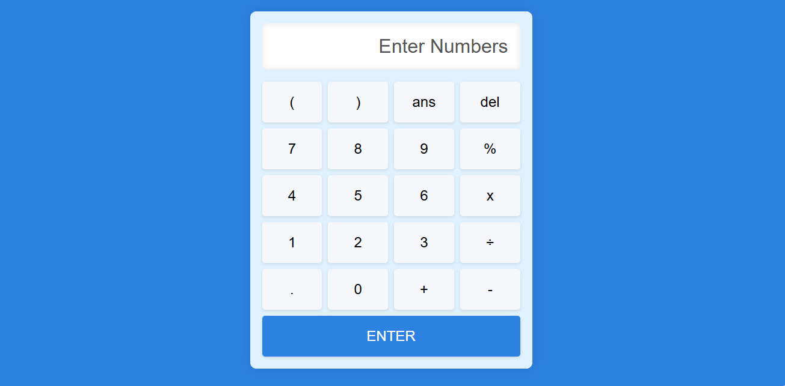
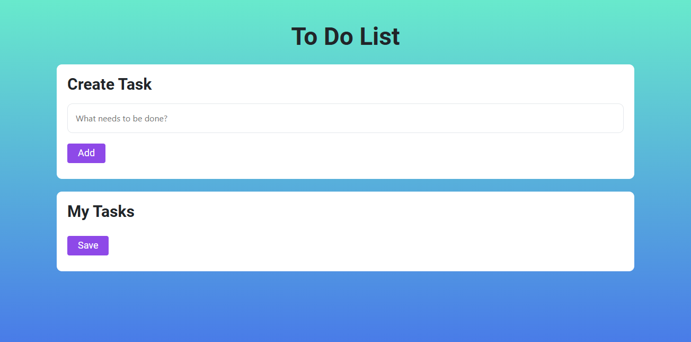

# Web Development Internship Projects

This repository contains projects completed during my internship at OASIS INFOBYTE as a web developer. The projects demonstrate various web development skills and include a scientific calculator, a tribute page, a to-do web app, and a backend login authentication system.

## Projects

### 1. Scientific Calculator
An interactive calculator that performs basic functions such as addition, subtraction, division, multiplication, percentage, and square root. It features:
- A display screen for user input and results.
- Grid system in CSS for button alignment.
- JavaScript eventListeners, if-else statements, operators, and loops for functionality.
  
    

### 2. Tribute Page
A responsive tribute page dedicated to Steve Jobs. It includes:
- Basic HTML and CSS for layout and design.
- Responsive design principles for mobile and desktop views.
  
  

### 3. To-Do Web App
A web application for managing daily tasks. Features include:
- Adding new tasks to a list.
- Marking tasks as complete.
- Separate lists for pending and completed tasks.
- Editing and deleting tasks.
- Displaying the date and time for task creation and completion.
 
  

### 4. Backend Login Authentication System
A backend system to handle user registration and login securely. Key features:
- User registration with username and password.
- Secure password storage using cryptographic libraries.
- User login with password verification.
- Page protection for authenticated users.
- Proper error handling for incorrect login credentials and already registered users.

 

## Installation

1. Clone the repository:
    ```bash
    git clone https://github.com/RameenFatimaAli/---
    ```
2. Navigate to the project directory:
    ```bash
    cd repository-name
    ```
3. Open the `index.html` file in your preferred web browser for frontend projects.
4. For the backend login authentication system, follow the setup instructions for MEAN-MongoDB, Express.js, Angular, Node.js.


## Features

- Scientific Calculator: Basic and advanced mathematical operations.
- Tribute Page: Information about Steve Jobs.
- To-Do Web App: Task management with date and time stamps.
- Backend Login Authentication: Secure user login and registration.

## Contributing

Contributions are welcome! Please fork this repository and submit a pull request for any improvements or additional features.

## License

This project is licensed under the MIT License.

## Contact

For any questions or support, please contact:
- Rameen Fatima Ali
- tarifaali2006@gmail.com
- https://www.linkedin.com/in/rameen-fatima-ali/

